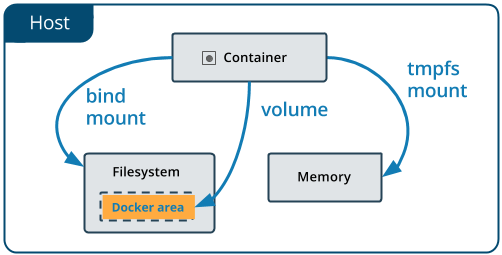

## 3 tipos de volumes:

- Bind - apontar um diretório do host para um do container
- Volume - docker gerencia o volume (o melhor/mais profissional, segundo o Jef)
- tmpfs - dados guardados na memória temporariamente; Use case: caso precise escrever dados na memória



### Tipo Bind

`-v`

`--mount type=,source=,target=`

Exemplo: 

```docker
docker run -it \
    --name testando-volumes \
    --mount type=bind,\
    source=/home/juan/Documents/Docker/Descomplicando_o_Docker/3_dominando_dockerfiles_e_gerenciamento_de_imgs/giropops-senhas,\
    target=/giropops-senhas \
    debian \
    sh
```

### Tipo Volume

`docker volume create {volume_name}`

`docker volume ls`

```docker
giropops-senhas git:(main) ✗ docker volume inspect giropops
[
    {
        "CreatedAt": "2025-12-30T00:29:29-03:00",
        "Driver": "local",
        "Labels": null,
        "Mountpoint": "/var/lib/docker/volumes/giropops/_data",
        "Name": "giropops",
        "Options": null,
        "Scope": "local"
    }
]
```

```docker
docker run -it \
    --name testando-volumes-v2 \
    --mount type=volume,\
    source=giropops,\
    target=/giropops \
    debian \
    sh
```

ou usando `-v`

```docker
docker run -d \
	--name testando-volumes-v3 \
	-v giropops:/usr/share/nginx/html \
	-p 8081:80 \
	nginx
```

### Tipo tmpfs

Volume **em memória (RAM)**.

❌ Não persiste

❌ Não grava em disco

✅ Rápido

✅ Ideal para dados temporários

Usos comuns:

- cache
- arquivos temporários
- dados sensíveis em runtime

---

- Usando `-mount`

```docker
docker run -it \
    --name testando-tmpfs \
    --mount type=tmpfs,target=/app/tmp,tmpfs-size=64m \
    debian \
    sh
```

---

- Usando `-tmpfs`

```docker
docker run -it \
    --name testando-tmpfs-v2 \
    --tmpfs /app/tmp:size=64m \
    debian \
    sh
```

> Tudo é perdido ao parar o container.
>