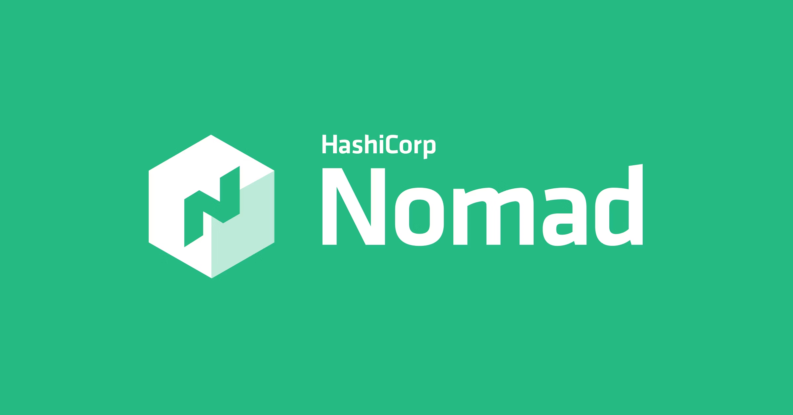

# Nomad 101

## Página do Projeto
https://developer.hashicorp.com/nomad

## Termos Imporantes
### Server
Fazendo uma analogia com Kuberentes, seria o Master Node, Control Plane.

### Client
Fazendo uma analogia com Kubernetes, seriam os Worker Nodes.

### Tasks
É a menor unidade do cluster Nomad. É algo que será executado por um driver.

### Task Groups
É um conjunto de Tasks que precisam ser executadas juntas, no mesmo client node.

### Driver
Quem vai executar suas tasks. Por exemplo: Docker, Java, QEMU, etc.

### Job
Fazendo uma analogia com Kubernetes, seria similar ao Deployment.